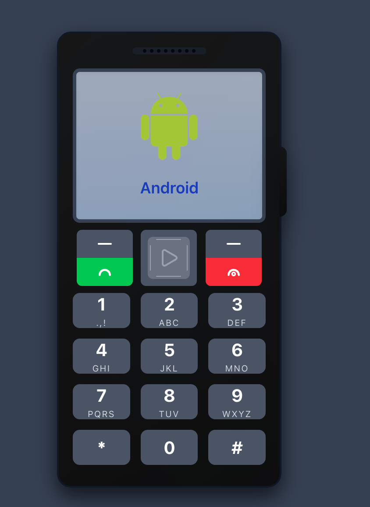
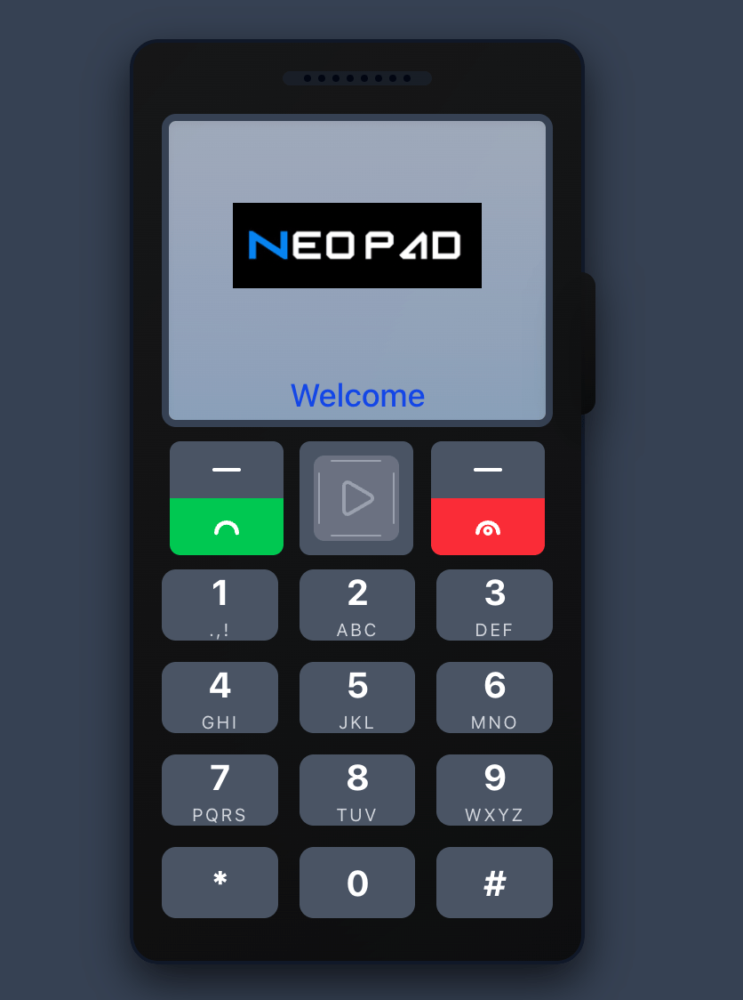
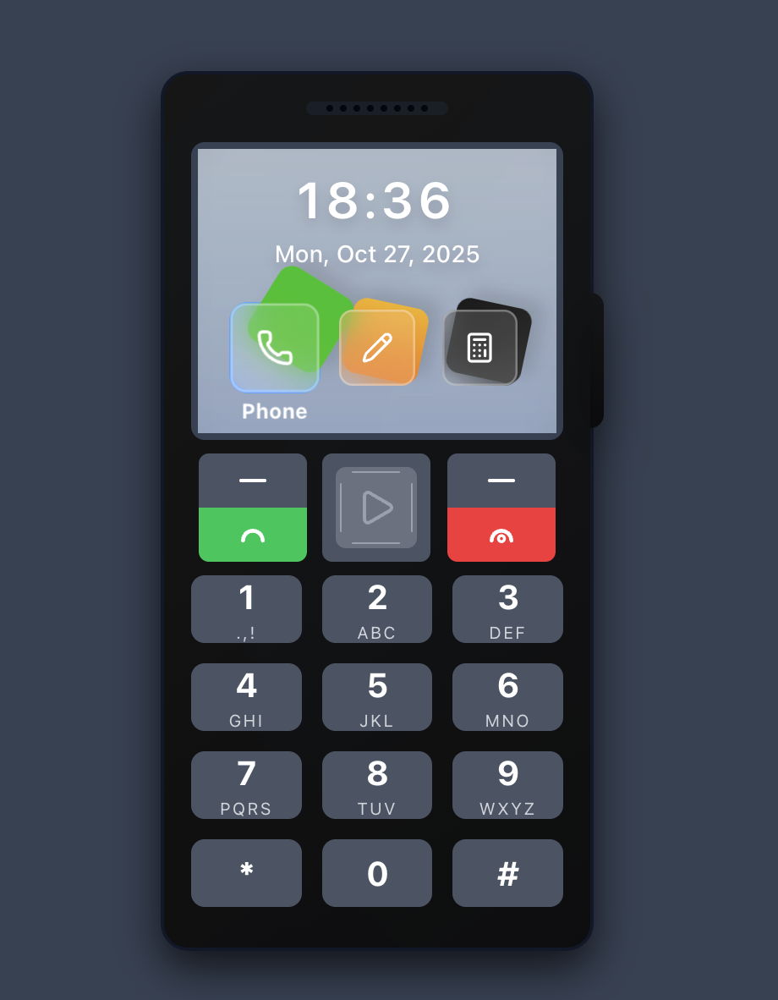
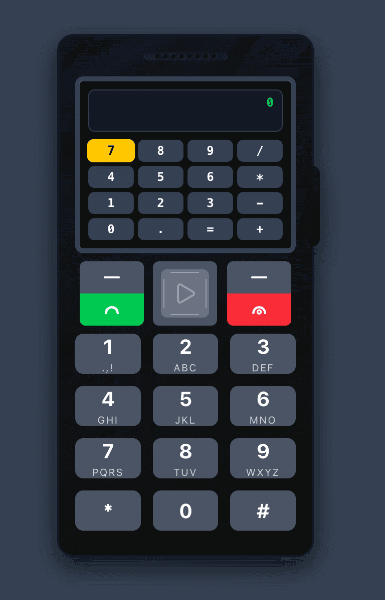
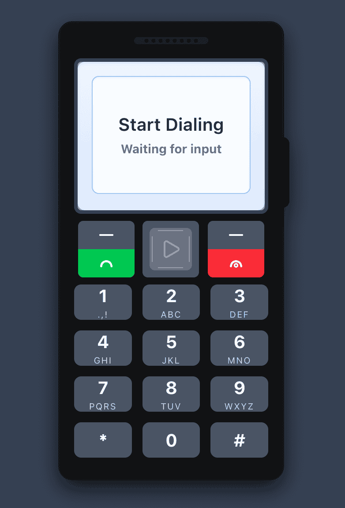
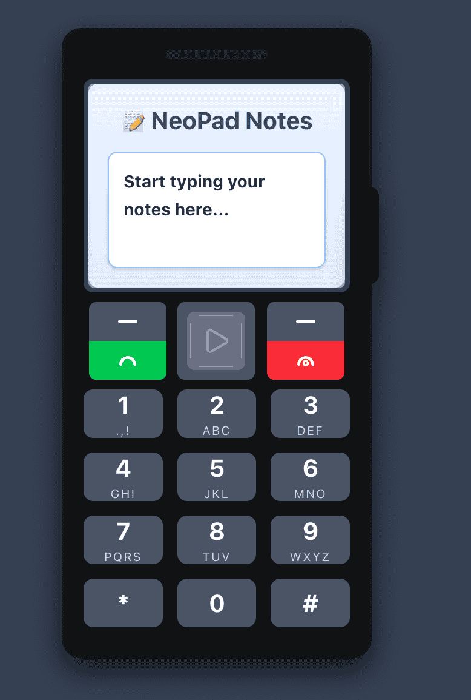

# NeoPad (1st Year REPO)

<strong>A nostalgic keypad mobile experience, right in your browser.</strong>

<em>A first-year project exploring complex UI logic with Next.js and Tailwind.</em>

> NeoPad is a single-page web application that faithfully recreates the experience of using a classic keypad mobile phone. It was built as a front-end challenge to implement complex, stateful logic in a clean UI.

> It's built with Next.js and Tailwind CSS and runs entirely in your browser—no backend required.

## 🚀 Screenshots

## Boot Screen (Loading)

 

 
 

## Home Page

 
 

## Calculator

 
 

## Phone

 
 

## Notes

 
 

## ✨ Key Features

> Classic Keypad Interface: Navigate the UI using on-screen buttons or your keyboard's arrow keys. Multi-Press T9 Logic: The core feature! Press '2' once for 'A', twice for 'B', three times for 'C', and four times for '2'.

Built-in Apps: Includes simple, working applications:

### 📞 Phone: A dialer that uses the multi-press logic.

### 📝 Notes: A simple note-taking app.

### 🧮 Calculator: A basic calculator.

- Nostalgic UI: Styled with Tailwind CSS to capture the feel of early 2000s mobile phones, complete with a boot screen.

- Fully Client-Side: Runs entirely in your browser. All logic is handled with React Hooks.

- 💡 Core Concept: The Multi-Press Key Logic

> The main technical challenge of this project was to replicate the T9-style multi-press text input from classic phones. This logic is handled entirely on the client-side using React's useState and useEffect hooks.

### A custom hook manages:

- Tracking the last key pressed.
- A timer (setTimeout) to check if the user is pressing the same key again within a short window (e.g., 800ms).

## 🛠️ Tech Stack

- Framework: Next.js (React)
- Styling: Tailwind CSS
- State Management: React Hooks (useState, useEffect)
- Icons: Lucide React

Install dependencies:

npm install
npm i lucide-react

npm run dev

Open http://localhost:3000 in your browser to see the app.
